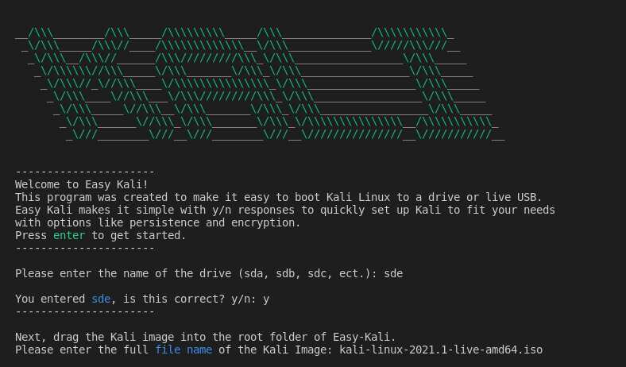

<!-- PROJECT LOGO -->
 

  

  <h3 align="center">Easy Kali</h3>

  

A quick, easy command line interface to set up Kali Linux on a live USB with options like persistence and encryption.
 

 

<!-- ABOUT THE PROJECT -->

## About The Project

While setting up Kali Linux is pretty straight forward with a simple `dd if={image} of=/dev/{drive}` command, it can get a little cumbersome when setting up persistence or encrypted persistence.  With Easy Kali and a few simple "y/n" questions, you can set this up in no-time! EKali also automatically verifies your Kali image by checking its SHA256 signature, which you can confirm on the <a href='https://www.kali.org/downloads/'>official Kali downloads page</a>.

This code is meant to be simple, clean and straightforward. Thats why we took the commands right from the <a href='https://www.kali.org/docs/usb/live-usb-install-with-linux/'>official guide on Kali.org</a> and streamlined the process.  If you want to see how it works under the hood, take a look at `inputs.py` or head to the official guide and see the commands.

For anyone new to persistence on Kali: Persistence is the preservation of data on the “Kali Live” USB drive across reboots of “Kali Live”. This can be an extremely useful enhancement, and enables you to retain documents, collected testing results, configurations, and more when running Kali Linux “Live” from the USB drive, even across different systems.

<!-- GETTING STARTED -->

## Getting Started

To run Easy Kali, first run `pip install -r requirements.txt` (This will enable the fancy banner that shows on startup). Then, simply run `python3 easyKali.py` and it will walk you through a few "y/n" answers to set up Kali. 

**Select Your Drive**  
First EKali will ask you to enter the name of your drive.  One quick way to identify your drive is to run `lsblk` in your terminal before plugging in your USB drive, and then after plugging it in, run `lsblk` again.  You should see a new drive appear with a name like "sbb","sbc","sbd", ect. 

**Flash Kali Onto Your Drive**  
Next, <u>drag your Kali image into the root folder of Easy Kali</u>. You will be prompted to enter the full file name of the image.  Easy Kali will then check the file's SHA256 signature for authenticity. After verifying the image, you will be asked to double check the info that you entered and then Easy Kali will flash the image onto your drive. 
Just a heads up, this step requires sudo and EKali will prompt you when needed. 

**Checkpoint**  
Kali Live is all ready to go. If you want to set up persistence and encryption, keep going. If not, Easy Kali will finish up and you can eject your drive!

**Persistence**  
This is where Easy Kali shines. EKali will ask you how big you want the partition to be, you enter it and thats it.

**Encryption**  
Lastly, Ekali will ask if you want to set up persistence. If so, it'll ask you to set up a passphrase for the encryption and then to verify your passphrase. And thats it, you are all set to go.
